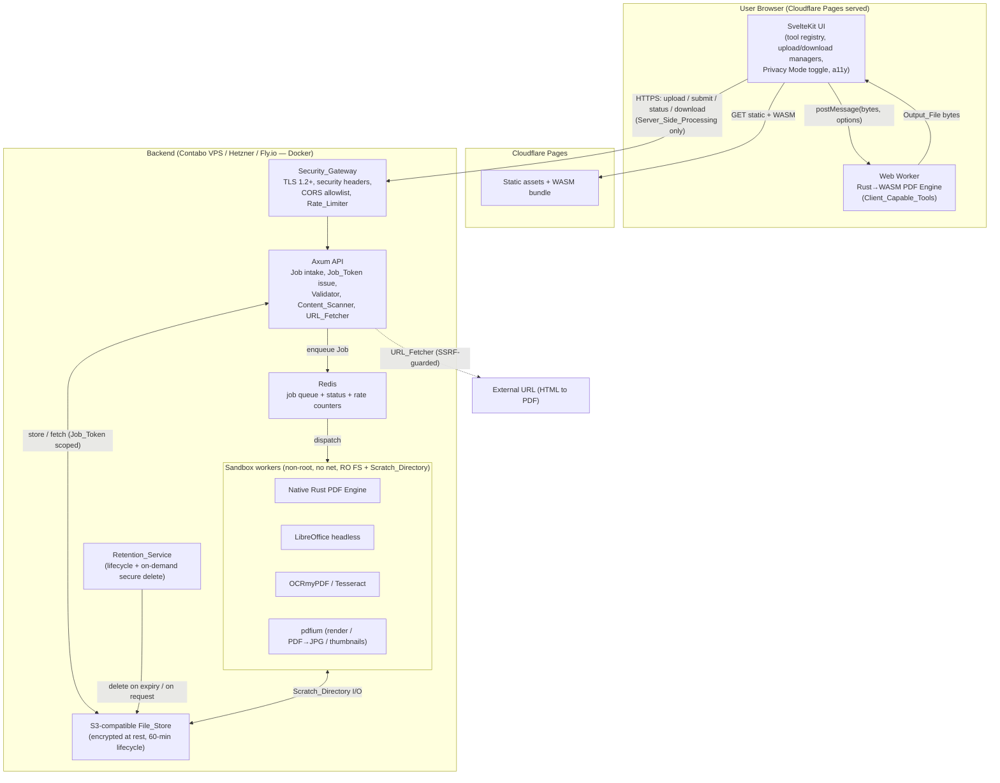

# Design Document

## Overview

PDF Tools Suite is delivered as a static, edge-served single-page application backed by a stateless, containerized processing service. The design is organized around one central idea: **a single PDF engine written in Rust is compiled twice — once to WebAssembly for in-browser execution and once to a native binary for server execution.** The same merge, split, rotate, watermark, page-numbering, crop, JPG↔PDF, compress, optimize, and Markdown logic therefore runs byte-for-byte identically whether a Job executes on the User's device (`Client_Side_Processing`) or on the server (`Server_Side_Processing`). This is what makes Privacy Mode (Req 37) a routing decision rather than a re-implementation.

### Technology stack (decided)

| Concern | Choice | Rationale (requirements) |
| --- | --- | --- |
| Frontend | SvelteKit + TypeScript | Smallest JS bundles and fast first render for the 2 s interactive target (Req 31.1), responsive layout (Req 34), and accessible components (Req 35). |
| Shared PDF engine | Rust → WASM (browser) **and** native (server) from one codebase | Identical logic on device or server; foundation of Privacy Mode (Req 37) and of the round-trip / page-count invariants (Req 30). |
| Client execution | Rust→WASM inside a Web Worker | Keeps the main thread responsive and isolates processing (Req 47.1). |
| Backend API + processing | Rust + Axum (async) | Low memory, high concurrency for non-blocking concurrent Jobs (Req 31.4) and sandbox orchestration (Req 40). |
| Server-only conversions | LibreOffice headless (Gotenberg-style) for Office↔PDF; OCRmyPDF/Tesseract for Scan-to-PDF OCR | Fidelity-heavy Office conversions and OCR that cannot run in the browser (Server_Only_Tool, Req 13–15, 19–22, 9). |
| Rendering / thumbnails / PDF→JPG | pdfium via `pdfium-render` | High-fidelity rasterization (Req 8.1 thumbnails, Req 18 PDF→JPG). |
| Job queue / status | Redis | Concurrent job status, rate-limit counters (Req 31.4, Req 42). |
| Temporary File_Store | S3-compatible object storage, server-side encryption at rest, lifecycle expiry | Encryption at rest (Req 44.1) and lifecycle expiry matching `Retention_Period` (Req 32.2). |
| Packaging | Docker (Rust service + LibreOffice + OCR + pdfium) | Reproducible, scannable images (Req 45). |

### Deployment (decided)

- **Frontend:** Cloudflare Pages (free tier, unlimited bandwidth/static requests) serves the static SvelteKit build and the WASM engine. Privacy Mode tools run entirely client-side at zero server cost.
- **Backend:** containerized. Primary low-cost target is a **Contabo VPS** (~$5/mo, high RAM for LibreOffice/OCR). Documented alternatives are **Hetzner CX** and **Fly.io** (scale-to-zero, global). Note: Hetzner's cheap AMD lines rose sharply in 2026, so Contabo remains the value pick for the RAM-heavy conversion workloads.
- **Object storage:** S3-compatible — Cloudflare R2 or the VPS provider's object storage — with server-side encryption and a 60-minute lifecycle rule matching `Retention_Period`.

### End-to-end Privacy Mode routing (client-first-optional / server-default)

The Processing_Mode is derived, never chosen directly (Req 37.3–37.4):

1. `Privacy_Mode` defaults to **disabled** (Req 37.2). With it disabled, every Job uses `Server_Side_Processing` (Req 37.3).
2. When the User enables `Privacy_Mode`, the UI consults the **tool registry** for the selected Tool:
   - If the Tool is a `Client_Capable_Tool`, Processing_Mode becomes `Client_Side_Processing`: the file is handed to the WASM engine in a Web Worker and its bytes are never transmitted to the Backend (Req 37.5, 47.2, 32.6).
   - If the Tool is a `Server_Only_Tool` (Office conversions, PDF→Office, PDF/A, OCR Scan-to-PDF), the toggle is **disabled** with a message that the Tool requires secure server processing (Req 37.7).
3. Guardrails at selection time:
   - If the browser lacks WebAssembly and Privacy_Mode is on, the UI disables Privacy_Mode and explains on-device processing is unavailable (Req 48.2).
   - If a Source_File exceeds the memory budget for client processing, the UI notifies the User the file will use `Server_Side_Processing` and requires confirmation before any bytes are transmitted (Req 37.8).
4. A client-side Privacy Mode indicator is shown while processing on-device (Req 37.6), and chained operations that stay within Client_Capable_Tools keep the file on the device across steps (Req 50.5).

This yields a **client-first-optional, server-default** product: reliable server processing out of the box, with an opt-in path that keeps files on the device for every Tool the browser can run.

## Architecture

The system has three planes: a static edge-served **UI plane**, an in-browser **client processing plane** (active only under Privacy Mode for Client_Capable_Tools), and a containerized **server processing plane** fronted by a Security_Gateway.



Key architectural properties:

- **The UI never sends file bytes for Client_Side_Processing Jobs** (Req 32.6, 47.2). Only status/telemetry that contains no file content ever leaves the device, and for pure client Jobs even that is unnecessary.
- **Every server Job crosses the Security_Gateway first** (Req 38, 42, 50.3), then the Axum API validates and scans before enqueue (Req 39), then executes inside a Sandbox (Req 40).
- **The File_Store is addressed only by Job_Token** (Req 43); no directory listing is exposed (Req 43.5).
- **The native engine and the WASM engine are the same crate**, so a page-count or round-trip property proven for one holds for the other (Req 30).

## Components and Interfaces

### 1. Shared Rust PDF engine (`pdf-engine` crate)

One crate, two compilation targets (`wasm32-unknown-unknown` for the browser, native for the server). It exposes a single dispatch surface so the UI and the Axum service call it identically.

```rust
/// Stable, panic-free API surface shared by WASM and native builds.
pub enum ToolId {
    Merge, Split, RemovePages, ExtractPages, Organize,
    OptimizePdf, CompressPdf, JpgToPdf, PdfToJpg,
    Rotate, AddPageNumbers, AddWatermark, Crop,
    MarkdownToPdf, PdfToMarkdown, EditPdf, PdfForms,
}

pub struct EngineInput<'a> {
    pub tool: ToolId,
    pub sources: Vec<FileBytes<'a>>,   // one or more Source_Files
    pub options: ToolOptions,          // tagged per tool (see Data Models)
}

pub struct EngineOutput {
    pub files: Vec<OutputFile>,        // one or more Output_Files
    pub source_page_counts: Vec<u32>,  // used to assert invariants (Req 30.3, 10.3, 11.3)
}

pub enum EngineError {
    Protected, Empty, Corrupt, Unsupported,
    SplitPointOutOfRange { page_count: u32 },
    NoTextFound, NoTableFound, NoOutputProduced,
    ResourceLimit(ResourceKind),
}

/// Single entry point. Pure with respect to inputs+options; performs no I/O.
pub fn run(input: EngineInput) -> Result<EngineOutput, EngineError>;
```

Design notes:
- `run` is **I/O-free and deterministic**: the caller supplies bytes and receives bytes. This makes it directly property-testable (Req 30) and lets the same function back both planes.
- Client_Capable_Tools are exactly the variants implementable without LibreOffice/OCR: Merge, Split, RemovePages, ExtractPages, Organize, OptimizePdf, CompressPdf, JpgToPdf, PdfToJpg, Rotate, AddPageNumbers, AddWatermark, Crop, MarkdownToPdf, and the layout/annotation tools (EditPdf, PdfForms). `PdfToJpg` and thumbnails use pdfium, which is available in both targets.
- Server_Only variants (Word/PPT/Excel↔PDF, PDF/A, OCR Scan-to-PDF) are **not** part of this crate's execution path; the server layer invokes LibreOffice/OCR subprocesses and wraps their results.

### 2. Tool registry

A single declarative table, shared in shape between the TypeScript UI and the Rust backend, that maps each `Tool` to its category, capability, default Processing_Mode behavior, and Supported_Formats. It is the source of truth for Privacy Mode routing (Req 37) and format validation (Req 2.8, 33.1, 39.1).

```ts
type Capability = "Client_Capable" | "Server_Only";

interface ToolDescriptor {
  id: ToolId;
  category: "Organize" | "ScanOptimize" | "ConvertTo" | "ConvertFrom" | "Edit";
  label: string;                 // Req 1.6 descriptive label
  capability: Capability;        // Req 37.4 / 37.7 routing
  supportedFormats: string[];    // Req 2.8 / 33.1 / 39.1 validation
  minSources?: number;           // e.g. Merge requires >= 2 (Req 4.4)
  producesMultiple?: boolean;    // e.g. Split, PDF to JPG (Req 3.2, 18.3)
}
```

`Server_Only` tools: Word to PDF, PowerPoint to PDF, Excel to PDF, PDF to Word, PDF to PowerPoint, PDF to Excel, PDF to PDF/A, and Scan to PDF when OCR text is requested (per the glossary). All others are `Client_Capable`.

The UI derives Processing_Mode as: `privacyMode && descriptor.capability === "Client_Capable" ? Client_Side : Server_Side` (Req 37.3, 37.4), disabling the toggle entirely for `Server_Only` (Req 37.7).

### 3. Privacy Mode logic (UI)

A small state machine the UI evaluates whenever the Tool or files change:

1. Resolve capability from the registry.
2. If `Server_Only` → force Server_Side, disable toggle, show server-processing message (Req 37.7).
3. Else if `Privacy_Mode` off → Server_Side (Req 37.3).
4. Else check preconditions: WebAssembly present (else disable Privacy Mode, Req 48.2) and file within client memory budget (else prompt for confirmed Server_Side fallback, Req 37.8).
5. Else → Client_Side; show on-device indicator (Req 37.6); route bytes to Web Worker only.

### 4. Upload_Manager

- Accepts files via drag-and-drop and file dialog (Req 2.1, 2.2).
- Enforces `Max_File_Size` (100 MB) and `Max_Batch_Count` (50) client-side with clear messages (Req 2.3, 2.4), and re-checks the same limits on the Backend for Server_Side Jobs (Req 39.2, 39.3).
- Validates Supported_Format against the registry before submit (Req 2.8).
- For Server_Side only: streams bytes with a byte-percentage progress bar (Req 2.6), and on connection interruption shows an error and offers retry (Req 2.7). For Client_Side, no transmission occurs (Req 32.6).

### 5. Download_Manager

- Presents each Output_File's name and size before download (Req 3.4).
- Single output → direct download; multiple outputs → both a ZIP archive and per-file controls (Req 3.2, 18.3).
- No authentication required for the User; access to server-stored outputs is gated by Job_Token (Req 3.3, 43.3).
- Server responses set `Content-Disposition: attachment` and a non-executable `Content-Type` (Req 50.2).
- Interrupted download → retry allowed while still within Retention_Period (Req 48.4).

### 6. Chained-operations handling

On successful Job completion, the UI offers "continue to another Tool" (Req 36.1). The selected Output_Files become Source_Files for the next Tool without re-upload (Req 36.2), and when multiple outputs exist the User selects which to carry forward (Req 36.4). Carried files pass the same format/size/batch validation as uploads (Req 36.3). Retention and Job_Token access rules continue to apply to chained files (Req 36.5, 36.6). If both the producing and consuming Tools are Client_Capable and Privacy_Mode is on, the file stays on the device across the chain and is never transmitted (Req 50.5).

### 7. Security_Gateway

Terminates TLS 1.2+ (Req 38.1), attaches HSTS, CSP (no inline script), X-Content-Type-Options, frame-ancestors/X-Frame-Options, Referrer-Policy, and secure cookie attributes (Req 38.2–38.7), enforces the CORS allowlist (Req 50.3), a maximum request body size (Req 42.4), and the Rate_Limiter (Req 42.1–42.3) before any request reaches the API.

### 8. Axum API and processing service

- Issues a `Job_Token` (≥128-bit CSPRNG) on Job creation (Req 43.1, 43.2) and scopes all file access to it (Req 43.3, 43.4).
- Runs the `Validator` (content-signature type detection, size/batch, zero-byte, decompression-ratio, archive bomb limits — Req 39.1–39.4, 42.5, 49.2, 50.4) and `Content_Scanner` (strip/reject embedded JS, launch actions, executables — Req 39.5, 39.6).
- `URL_Fetcher` for HTML to PDF enforces scheme allowlist, Private_IP_Range blocking on every redirect hop, redirect cap, and fetch timeout (Req 41).
- Enqueues Jobs to Redis and dispatches to Sandbox workers so concurrent Jobs never block one another (Req 31.4).
- Dispatches Client_Capable logic to the native `pdf-engine`; dispatches Server_Only work to sandboxed LibreOffice / OCRmyPDF / pdfium subprocesses.

### 9. Sandbox workers

Each Server_Side Job runs as a non-root process, read-only filesystem except its per-Job `Scratch_Directory`, no outbound network, and CPU/memory/wall-clock limits (Req 40). Exceeding limits terminates the Job with an error naming the exceeded resource (Req 40.4). One Job cannot reach another Job's Scratch_Directory (Req 40.7).

### 10. Retention_Service

Deletes Source_Files and Output_Files when Retention_Period (60 min) elapses (Req 32.2, 44.2) and immediately on User request (Req 32.3, 44.3), using secure deletion. Backed by an S3 lifecycle rule plus an application-level sweeper for on-demand deletes.

## Data Models

```rust
/// A single execution of a Tool. Server-side Jobs are persisted in Redis;
/// client-side Jobs exist only in browser memory.
struct Job {
    id: JobId,                     // opaque server id
    token: JobToken,               // >=128-bit CSPRNG, access credential (Req 43)
    tool: ToolId,
    processing_mode: ProcessingMode, // Client_Side | Server_Side (Req 37)
    status: JobStatus,             // Queued | Running | Succeeded | Failed(reason)
    source_refs: Vec<FileRef>,     // File_Store keys (server-side only)
    output_refs: Vec<FileRef>,
    created_at: Instant,
    expires_at: Instant,           // created_at + Retention_Period (Req 32.2)
}

/// High-entropy access credential; never logged (Req 44.4, 46.2).
struct JobToken(String);           // url-safe, >=128 bits entropy (Req 43.2)

/// Metadata about a stored file; content stored encrypted at rest (Req 44.1).
struct FileRef {
    store_key: String,             // opaque; never a client-supplied path (Req 50.1)
    display_name: String,          // sanitized, path-separator-free (Req 50.1)
    size_bytes: u64,               // shown pre-download (Req 3.4)
    content_type: String,          // non-executable on download (Req 50.2)
    page_count: Option<u32>,       // for invariants (Req 30.3, 10.3, 11.3)
}

enum ProcessingMode { ClientSide, ServerSide }

enum JobStatus { Queued, Running, Succeeded, Failed(FailureReason) }
```

Tool options are a tagged union so each Tool carries only its own settings:

```rust
enum ToolOptions {
    Merge { order: Vec<usize> },                                   // Req 4.2
    Split { split_points: Vec<u32>, fixed_size: Option<u32> },     // Req 5.1, 5.2
    RemovePages { pages: Vec<u32> },                               // Req 6.1
    ExtractPages { pages: Vec<u32> },                              // Req 7.1
    Organize { order: Vec<usize>, rotations: Vec<(u32, Angle)>, deletes: Vec<u32> }, // Req 8
    Optimize { level: Level },                                     // Req 10.2
    Compress { level: Level },                                     // Req 11.2
    JpgToPdf { orientation: Orientation, margin: Margin, order: Vec<usize> }, // Req 12
    PdfToJpg { dpi: u32 },                                         // Req 18.2
    Rotate { angle: Angle, pages: PageScope },                     // Req 24
    AddPageNumbers { position: Position, start: u32 },             // Req 25
    AddWatermark { text: Option<String>, image: Option<FileRef>, opacity: u8, rotation_deg: i16 }, // Req 26
    Crop { region: Rect, all_pages: bool },                        // Req 27
    MarkdownToPdf { text: String },                                // Req 17
    PdfToMarkdown {},                                              // Req 23
    EditPdf { elements: Vec<Element> },                           // Req 28
    PdfForms { field_values: Vec<(String, String)>, added_fields: Vec<FormField> }, // Req 29
    // Server_Only tools carry conversion-specific options resolved in the server layer:
    WordToPdf {}, PptToPdf {}, ExcelToPdf { orientation: Orientation },
    HtmlToPdf { source: HtmlSource, orientation: Orientation },    // Req 16
    PdfToWord {}, PdfToPptx {}, PdfToExcel {},
    PdfToPdfA { level: PdfALevel },                                // Req 22
    ScanToPdf { images: Vec<FileRef>, ocr: bool },                // Req 9 (ocr=true => Server_Only)
}

enum Level { Low, Medium, High }
enum Angle { D90, D180, D270 }
enum Orientation { Portrait, Landscape }
enum Margin { None, Small, Large }
enum PdfALevel { A1b, A2b, A3b }
enum HtmlSource { Url(String), Inline(String) }
```

## Correctness Properties

*A property is a characteristic or behavior that should hold true across all valid executions of a system — essentially, a formal statement about what the system should do. Properties serve as the bridge between human-readable specifications and machine-verifiable correctness guarantees.*

Because the merge/split/rotate/watermark/page-number/crop/JPG↔PDF/optimize/compress/Markdown logic is a single pure Rust function (`pdf-engine::run`), every property below is validated once and holds for **both** the WASM (client) and native (server) builds.

### Property 1: Merge preserves and concatenates pages in source order

*For all* lists of two or more valid PDF Source_Files, running Merge produces exactly one Output_File whose page count equals the sum of the source page counts, with pages appearing in the User-specified source sequence.

**Validates: Requirements 4.1, 4.2**

### Property 2: Split partitions the document exactly

*For all* PDF Source_Files and all valid split-point sets, Split produces one Output_File per resulting range, and concatenating the ranges in order reproduces the original page sequence with no page lost or duplicated.

**Validates: Requirements 5.1, 5.2**

### Property 3: Split rejects out-of-range split points

*For all* split points greater than the Source_File's page count, the engine rejects the Job with an error carrying the actual page count.

**Validates: Requirements 5.3**

### Property 4: Remove Pages yields the complement in original order

*For all* PDF Source_Files and all selected page subsets that leave at least one page, the Output_File contains exactly the pages not selected, in their original relative order.

**Validates: Requirements 6.1**

### Property 5: Extract Pages page count equals selection size

*For all* PDF Source_Files and all non-empty page selections, the Output_File's page count equals the number of selected pages, and those pages appear in their original order.

**Validates: Requirements 7.1, 30.3**

### Property 6: Organize applies the requested permutation

*For all* PDF Source_Files and all permutations (with optional per-page rotation/deletion), the Output_File's page sequence matches the order specified by the User.

**Validates: Requirements 8.2, 8.3, 8.4**

### Property 7: Optimize and Compress never grow the file and preserve page count

*For all* PDF Source_Files and all levels (Low/Medium/High), the Output_File's size is less than or equal to the Source_File's size and the page count is unchanged.

**Validates: Requirements 10.1, 10.3, 11.1, 11.3**

### Property 8: JPG to PDF produces one page per image

*For all* lists of JPG Source_Files, the Output_File's page count equals the number of JPG Source_Files.

**Validates: Requirements 12.1**

### Property 9: PDF to JPG produces one image per page

*For all* PDF Source_Files, the number of JPG Output_Files equals the Source_File's page count.

**Validates: Requirements 18.1**

### Property 10: JPG round-trip preserves image count

*For all* lists of JPG Source_Files, running JPG to PDF and then PDF to JPG produces exactly one JPG Output_File per original JPG Source_File.

**Validates: Requirements 30.2**

### Property 11: Markdown round-trip preserves structure

*For all* Markdown Source_Files composed of headings, lists, and paragraph text, running Markdown to PDF and then PDF to Markdown produces Markdown whose headings, lists, and paragraph text match the original.

**Validates: Requirements 30.1**

### Property 12: Rotate is angle-correct and four 90° turns are the identity

*For all* PDF Source_Files, rotating the selected pages sets their orientation by the selected angle, and rotating any page by 90 degrees four times restores its original orientation.

**Validates: Requirements 24.1, 24.2, 24.3**

### Property 13: Per-page annotations preserve page count and mark every page

*For all* PDF Source_Files, running Add Page Numbers, Add Watermark, or Crop preserves the page count and applies the requested change (a number element, the watermark, or the crop region) to every targeted page.

**Validates: Requirements 25.1, 26.1, 27.1**

### Property 14: Multiple outputs receive unique names

*For all* Jobs that produce more than one Output_File, the assigned display names are pairwise distinct.

**Validates: Requirements 49.3**

### Property 15: Filenames cannot cause path traversal

*For all* input file-name strings (including those containing path separators or relative segments such as "../"), the sanitized name contains no path separators or relative path segments and resolves to a location inside the File_Store directory.

**Validates: Requirements 50.1**

### Property 16: Active content is removed or the file is rejected

*For all* PDF Source_Files augmented with embedded JavaScript, launch actions, or embedded executables, the file used for processing contains none of that active content, or the Content_Scanner rejects the Source_File.

**Validates: Requirements 39.5, 39.6**

### Property 17: URL fetches to private ranges are rejected

*For all* URLs that resolve to an address within a Private_IP_Range — whether at the initial address or at any redirect hop — the URL_Fetcher rejects the Job.

**Validates: Requirements 41.3, 41.4**

### Property 18: Only http/https URL schemes are accepted

*For all* URLs whose scheme is not http or https, the URL_Fetcher rejects the Job with a scheme-not-permitted message.

**Validates: Requirements 41.1, 41.2**

### Property 19: Job_Tokens are high-entropy and unique

*For all* generated Job_Tokens, each is a URL-safe value carrying at least 128 bits of entropy from a cryptographically secure generator, and no two tokens collide across a large sample.

**Validates: Requirements 43.1, 43.2**

### Property 20: File access requires the correct, unexpired Job_Token

*For all* file-access requests, access is granted if and only if the request presents the Job_Token issued for that Job and the current time is before the Job's expiry.

**Validates: Requirements 43.3, 43.4, 32.4, 36.6**

### Property 21: Client_Side_Processing transmits no source bytes

*For all* Client_Capable_Tools executed under Privacy_Mode (including chained client-to-client operations), no network request carrying the bytes of the Source_File or Output_File is issued to the Backend.

**Validates: Requirements 32.6, 47.2, 50.5**

### Property 22: Sandboxed Jobs cannot access one another's scratch space

*For all* pairs of distinct Jobs, a Job process cannot read or write the Scratch_Directory assigned to any other Job.

**Validates: Requirements 40.7**

### Property 23: Archive-bomb inputs are rejected

*For all* archive-based Source_Files (DOCX/XLSX/PPTX) whose uncompressed size exceeds the configured expansion ratio or whose nesting exceeds the configured depth, the Validator rejects the Source_File.

**Validates: Requirements 42.5, 50.4**

### Property 24: Tool search filters by name substring

*For all* search query strings, the filtered result set is exactly the Tools whose labels contain the query text.

**Validates: Requirements 1.5**

## Error Handling

Errors are classified and surfaced with a clear message identifying the failed Tool and reason (Req 33.3). On any failure the Backend retains no partial Output_File in the File_Store (Req 33.4, 49.4).

| Condition | Handling | Requirement |
| --- | --- | --- |
| No Source_File added | UI shows Empty_State describing how to add a file and disables the run action | Req 48.1 |
| Browser lacks WebAssembly while Privacy_Mode on | UI disables Privacy_Mode and explains on-device processing is unavailable; Job falls back to Server_Side | Req 48.2 |
| Client memory too small for on-device Job | UI notifies User and requires explicit confirmation before transmitting bytes for Server_Side_Processing | Req 37.8 |
| Tab closed/reloaded during a running Server_Side Job | `beforeunload` warning that the in-progress Job may be lost | Req 48.3 |
| Multiple Jobs in one session | Each running Job's status is displayed independently | Req 48.5 |
| Upload connection interrupted | Error message plus retry (Server_Side only) | Req 2.7 |
| Download interrupted | Retry allowed while the Output_File is still within Retention_Period | Req 48.4 |
| Protected_File cannot be opened | Reject Job; message states the file is protected | Req 49.1 |
| Zero-byte Source_File | Validator rejects; message states the file is empty | Req 49.2 |
| Corrupt/unparseable file | Validator/engine rejects; message states the file is corrupt / cannot be processed | Req 33.2, 39.7 |
| Unsupported format for Tool | Upload rejected; message lists Supported_Formats | Req 2.8, 33.1, 39.1 |
| Split point beyond page count | Reject Job; message states the page count | Req 5.3 |
| No extractable text (PDF to Word/Markdown) | Reject Job; message states no text found | Req 19.3 |
| No detectable table (PDF to Excel) | Reject Job; message states no table found | Req 21.3 |
| Conversion cannot be rendered (Office→PDF) | Reject Job; message identifies the conversion failure | Req 13.3, 14.3, 15.4 |
| URL cannot be retrieved / disallowed | Reject Job; message states retrieval failure or that scheme/destination is not permitted | Req 16.4, 41.2, 41.3 |
| Colliding output names | Assign each Output_File a unique name | Req 49.3 |
| File_Store storage exhausted | Reject Job; message states it cannot be completed now; retain no partial output | Req 49.4 |
| Server_Only dependency unavailable (LibreOffice/OCR down) | Reject Job; message states the Tool is temporarily unavailable | Req 49.5 |
| Job produces no Output_File | Report failure; message states no output was produced | Req 49.6 |
| Sandbox resource limit exceeded | Terminate Job; error names the exceeded resource (CPU/memory/wall-clock) | Req 40.4 |
| Rate limit exceeded | Reject request with rate-limit status; record anomaly if rejection rate is high | Req 42.3, 46.4 |

## Testing Strategy

A dual approach: property-based tests verify universal invariants across many generated inputs, and unit/integration tests cover concrete examples, edge cases, and infrastructure behavior.

### Property-based tests

- Library: **`proptest`** for the Rust `pdf-engine` crate (native and WASM-targeted logic) and the security helpers; **`fast-check`** for the TypeScript UI search/registry logic. We do not implement property testing from scratch.
- Each property test runs a **minimum of 100 iterations**.
- Each test is tagged with a comment referencing its design property, in the format:
  `// Feature: pdf-tools-suite, Property {number}: {property_text}`
- Each of the 24 correctness properties is implemented by a **single** property-based test:
  - Generators: random valid PDFs (varying page counts), JPG lists, structured Markdown docs, permutations/subsets of page indices, arbitrary filename strings (including `../` and separators), PDFs augmented with active content, URLs across schemes and resolving to private/public ranges, and Job_Token samples.
  - Because engine logic is shared, page-set-algebra (Properties 1–9), round-trip (10–11), rotation identity (12), and annotation invariants (13) are proven once and apply to both planes.
  - Security properties (14–23) exercise the sanitizer, Content_Scanner, URL_Fetcher, token generator/checker, client transmission recorder, sandbox access, and archive limits.

### Unit tests (examples and edge cases)

- Guard conditions: Merge requires ≥2 files (Req 4.4), Remove Pages requires ≥1 retained page (Req 6.2).
- Error-condition examples: protected, zero-byte, corrupt inputs (Req 49.1, 49.2, 33.2); no-text and no-table conversions (Req 19.3, 21.3).
- Chained-operation validation reuses upload validation (Req 36.3).

### Integration tests

- **Server_Only conversions** through sandboxed LibreOffice/OCR/pdfium with 1–3 representative inputs each (Req 13–15, 19–22, 9), including failure-message cases (Req 13.3, 14.3, 15.4, 49.5).
- **Security headers** on responses: HSTS, CSP (no inline script), X-Content-Type-Options, frame-ancestors/X-Frame-Options, Referrer-Policy, secure cookie attributes (Req 38), CORS allowlist (Req 50.3), Content-Disposition/Content-Type on downloads (Req 50.2).
- **Performance**: initial interactive render within 2 s on broadband (Req 31.1); a ≤10 MB Job returns output or error within 10 s (Req 31.2); tool workspace opens within 300 ms (Req 1.3); concurrent Jobs progress independently (Req 31.4).
- **Retention**: files deleted at Retention_Period expiry and on demand; Job_Token rejected after expiry (Req 32.2, 32.3, 43.4, 44.2, 44.3).
- **Supply chain**: Dependency_Scanner runs on build and fails on critical-severity findings (Req 45).

### Security tests

- SSRF suite covering scheme rejection and Private_IP_Range blocking on initial and redirect hops, redirect cap, and fetch timeout (Req 41).
- Sandbox isolation: attempt cross-Job Scratch_Directory access (denied), no outbound network, non-root, read-only FS, and resource-limit termination (Req 40).
- Content-safety: active-content stripping/rejection (Req 39.5, 39.6) and archive-bomb rejection (Req 42.5, 50.4).
- Access control: no directory listing (Req 43.5); Job_Token required for all file access (Req 43.3).
- Logging: Security_Log excludes PII and file content, records anomalies (Req 44.4, 46).

### Accessibility and responsive tests

- Automated `axe-core` checks for WCAG AA, keyboard operability, text alternatives, contrast, and status announcements, plus manual screen-reader/keyboard verification (Req 35).
- Viewport example tests at 320 / 768 / 1024 px for single- vs multi-column layout and no horizontal scroll (Req 34).

> Note: full WCAG AA conformance cannot be established by automated tooling alone; it requires manual testing with assistive technologies and expert accessibility review.
